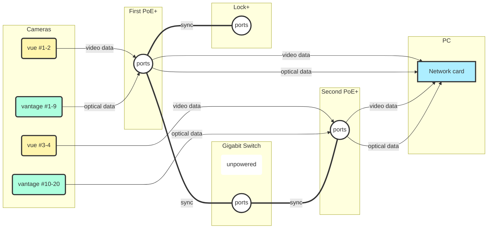

Protocol
========

> 2017-10-01 Lydia Created

---

Initialising
------------

1.	Switch on cameras, POE, Lock+, computer at least 45 mins before calibration.
2.	Locate **Error Book** and be prepared to fill out any errors encountered with sufficient detail. See below.
3.	Locate **Log Book** and fill in details of when the system was switched on. See below.
4.	Open **Nexus** Software on the computer.
5.	Check all cameras are displayed in green in the *left hand panel* within **Nexus**. In addition, check the **Lock+** is 	attached.
6.	Check the *master* has been set correctly (the Lock+).
7.	Cover all markers within the room.
8.	Verify the **Active Wand** has been charged recently.
9.	Check the **SSDs** are relatively empty. If not, see "Transfer" section below.
10.	Check **D drive** is relatively empty. If not, see "Backup" section below.

Calibration
-----------

> *See below for common errors. Record errors encountered in the Error Book.*

1.	Select the **Calibration tab** in the *right hand pane*.

 
1.	Select all cameras in the *left hand panel* and press `Video Calibration Setup > Activate` in the *right hand panel*. If greyed out, check in *live mode*.

####Masking

1.	Change view to **Cameras** with all cameras still highlighted in *left hand panel*.

1.	Check there are no bright spots visible within the recording volume other than lights and other camera strobes.
2.	Select `Mask Cameras > Start` in the *right hand panel*.
3.	Wait several seconds until all white spots have become blue. Once the masks have been produced and checked, select `Stop`.

####Active Wand

1.	Locate the **Active Wand** and verify the battery notification shows full charge.
2.	Check settings in the **Calibration tab**:
	-	Check `Active Wand v2` is selected
	-	Check `Refinement frames` are set as advised.
3.	Ensure Active wand is set to `Strobe`. 
4.	Select `Start`.
5.	Switch on **Active Wand** and move it around the recording volume.
	-	Do not stay in one portion of the room but move up and down continually. Some cameras will see the wand from anywhere in the volume and too many frames can overload the calibration process.
	-	Aim to fill the entire recording volume. Progress can be checked on the computer. Large arm movements are essential.
	-	Cameras will flash while they record frames and a pie chart will steadily fill.
	-	The process will end automatically (dependent on settings)
6.	Once complete, verify the recording volume was sufficiently covered. Otherwise restart.
7.	The calculations will begin automatically. Once complete, error values are displayed for each camera.
8.	Error can also be checked by observing the centroid fit of the LED lights on the **Active Wand**.

####Set Origin

1.	Switch on the **Active Wand** and place it at the origin position as advised. Raise or lower until the spirit level registers the wand is level.
2.	Select `Set Origin > Start` and once the **Active Wand** is correctly placed, select `Set`.
3.	Check the floorspace and camera order in `3D Perspective View` in the central panel.

#### Deactivate

1.	Press the `Deactivate` button in the **Calibration tab**.

Recording Preparation
---------------------

> *While the following instructions are detailed, these steps are only for viewing clarity within Nexus. The structure is not inherently saved within the recorded trials. The folder structure is available within Windows Explorer but copying errors can easily lead to this metadata being lost. **Be aware that correct file naming convention is therefore extremely important.***

1.	At the base of the central panel, double click `Data Management`.
2.	If necessary, create a new `Database` by clicking the  icon and navigating to the desired folder. The current position in the directory tree can be opened by selecting the blue hyperlink.
3.	Otherwise, ensure the current open `Database` is correct.
4.	If necessary, create a new `Top Level` by selecting either of these icons .
	-	The green is used for Patient Classification and is likely unhelpful.
	-	This top level should describe the experiment type, for example, the general aim of the experimental period. One example may be `Acquisition of Perching`.
	-	As an alternative naming convention, the owner of the data e.g. `Caroline` might also be used.
5.	Otherwise, double click the appropriate `Top Level` that is already created.
6.	Within the `Top Level` a new `Session`  should be created as this is a new experimental session. This must be named with the date of the recording, and the type of flight behaviour recorded. `28Sept_Perch2Perch` is one example.
7.	Double click the `Day`
8.	Create multiple `Hawk` folders by selecting this icon  and name the different hawks you intend to record.

In summary, the folder convention is as follows:`Database > Experimental Project > Date of Session > Hawk Name > Trials`

Subject Creation
----------------

> *Creating a new subject template is not covered here, this step assumes the templates are already present.*

1.	Ensure the current folder directory is within a `Hawk`.
2.	In the *left hand panel* select the **Subject tab** which resembles a person. 
3.	Select the icon with a + symbol and a person, which should read `Create new subject from template...`
4.	In the popup select which subject you are creating. It may be the hawk, or a perch. Name the template appropriately.
5.	The new subject will appear with an asterisk. Right click the subject and select `Save`. *Note: forgetting to save will delete the subjects once you switch directories.*
6.	The Subject file will appear in the `Folder Directory` in red.
7.	Repeat for all necessary subjects, and repeat for the different `Hawk` folders.
8.	It is useful to return to the `System tab` in the *left hand panel* so that any camera faults can be observed.

Trial recording
---------------

1.	In the *right hand panel*, select the **Recording tab**. 
2.	In the trial name, enter `test` or similar.
3.	Determine which cameras are necessary for recording. If the video cameras can be ignored, select this option from the settings. Additionally, check they are selected if video data is necessary.
4.	Change the `Trigger` delay as advised.
5.	Check the `Buffer` is 2 secs or similar. Too long and recording will malfunction.
6.	Select `Start` to record a test trial and then press `Stop`. Check for any errors that prevent you from recording (and note them down).
7.	Delete any `test files` afterwards to reduce disk space useage.
8.	As previously discussed, **trial naming convention is critical** to prevent loss of metadata. The trial names should include the date, hawk identity, flight behaviour, trial iteration. For example: `170929_Drogon_Perching12m_01`.
9.	Trials will iterate automatically (dependent on settings) so ensure the trial number is at the very end.
10.	For ease of sorting, the date should appear first and entered backwards: `YYMMDD`.
11.	As a rule of thumb, include all critical information in the filename should the file move folder directory.
12.	Record further details about the trials in the **Log Book**, as well as specific events of note during the experiment.
13.	Recordings should last around 30s dependent on the flight behaviour.
	-	Longer recordings of several minutes may fail and all data will be lost.
	-	The longer the recording, the longer the buffer requires to unload which can delay starting a new trial.
	-	Shorter recordings (such as an individual perching flight ~4secs) may overload the buffer if a new trial recording is started too quickly.
	-	Human error of recording very short trials can also lead to missed data.
	-	Video recordings can make the entire process more unstable.
	-	For safety, after pressing stop try to wait five seconds between the start button becoming available and pressing it.

Video Compression
-----------------

1.	If video data was recorded during trials, the raw files must be compressed and added to the data folder.
	-	This allows use of the video files as reference for processing the data in Nexus.
	-	The `raw video files` are stored on the **SSDs** separately to the recorded trial data.
2.	Select the transfer icon in the `Data management` tab with the desired directory open. 
3.	Select which video files to compress, or `Select all untransfered filed`. Begin transfer.
4.	Note the `M` symbol next to the trials in the `Data management` tab.

Clearing the SSD
----------------

1.	In a relatively short time, recording video data with trials will fill the **SSDs** on the computer and prevent new trials from being recorded.
	-	Always check the **SSDs** before setting up an experiment.
2.	Check all video files have been compressed as described in the previous step
	-	Failure to do so will not allow intergration of optical and video data for a given trial within **Nexus**.
3.	Decide whether the raw video files ought to be kept or discarded. If appropriate, delete.
4.	Otherwise, use **SyncBack** software to copy the contents of the two **SSDs** over to the `D: drive` or to an `external HDD`.

Backing up Data
---------------

1.	As with the **SSDs**, the disk space on the computer will fill relatively quickly (but not as quickly as the **SSDs**).
	-	Always check disk space before setting up an experiment.
2.	Using **SyncBack**, regularly transfer files from the computer onto external HDDs or onto online servers.
	-	**SyncBack** software has many advantages over traditional copy and paste and is far more robust.

Extra Steps
-----------

1.	The light levels should be regularly recorded around the recording volume.
2.	The temperature may also be useful.

---

Common Errors
=============

Calibration
-----------

#### *The Active Wand is flashing. Should I change to "continuous"?*

The Active wand must always be set to strobe unless advised otherwise. The blinking means the wand and cameras are not in sync and this might be due to few cameras being able to see the wand, or a problem in the syncing between the cameras.

Setting the Wand to continuous appears to "fix" the issue as the blinking will not happen during this mode. However, it is merely hiding a larger problem.

#### *Calibration is very sluggish*

Low battery of the Actuve Wand makes camera detection difficult. This may also indicate a camera is not able to see the wand due to being out of sync. Check the computer during the calibration or the pie charts on the cameras in case a camera has disconnected/encountered an error.

#### *Calibration error is very high*

The error numbers alone are an indication, and so checking the centroid reconstruction is a good verification. High error can be caused by low Active Wand battery, incorrect focus of the cameras, incorrect settings, or a greater problem.

#### *The calibration can't find a solution*

If the process fails at the point of calculating camera positions, check you have sufficiently covered the recording space. This is indicative of a greater problem, so contact Vicon.

Markers
-------

#### *Markers don't appear in certain places in the room*

Flickering or missing markers may occur at the boundaries of the recording area or within blind spots. Flickering normally indicates too few cameras can see the markers.

Check camera coverage using the Active Wand to determine the presence of blind spots or areas with poor coverage. It may only become apparent in recorded trials that coverage is unsatisfactory. - Selecting the **Active wand** centroids in `Live Mode` within Nexus using `Ctrl+Alt+Click` will show which cameras can see the wand in real time. - Use small markers rather than the wand for a more accurate indication.

Appropriate coverage should mean the wand is seen by more than 4 cameras in every position within the recording volume. The boundaries of the recording volume will always prove problematic and should be avoided. If the coverage is problematic, cameras should be adjusted or fully moved.

> ***Do not attempt moving cameras without sufficient training OR without full discussion with the group. In addition, consider contacting Vicon.***

Coverage is difficult to correct and moving cameras can cause more problems, not to mention the difficulties of reaching the cameras which may prove dangerous.

An alternative is moving the experimental setup with the known coverage in mind. You can also reduce the minimum number of cameras required for reconstruction in Nexus settings. Better reconstruction in areas of poor coverage are likely improved in **Tracker**.

#### *A camera can't see markers in front of it*

(If this is only the case for the **Active Wand** in strobe mode, see above in `Common Errors ... Calibration`.)

In the first instance, check the camera is connected. Also reboot it.

If the individual camera/s cannot see a marker within its viewing area then this is unlikely a problem of coverage. Check first that the area has not been blocked or masked.

-	Select `Camera View` in the central panel
-	Choose the camera from the `System Tab`
-	Check the area of interest is not shaded in blue
-	Clear the masks to be sure (a cross in the central panel)
-	Check the area of interest is not covered by a light source

If too much light is present the camera may not be able to see the marker.

If the camera struggles to pick up any markers regardless of position, it may have a fault, so attempt to reboot. If persistent, it may be caused by poor focus or aperture of the camera. The cameras have settings on the lenses which can be physically adjusted.

> ***Do not attempt changing lens settings on the cameras without sufficient training OR without full discussion with the group. In addition, consider contacting Vicon.***

The cameras have been appropriately focussed by Vicon, and a sudden problem would not spontaneously arise. This could only happen if the focus/aperture was altered on the camera itself. Decide if this could have happened. If the cameras have not been physically interfered with, assume the hardware settings are correct.

There are software settings that may be to blame.

-	Select `Camera View` in the central panel in Nexus.
-	Choose the camera from the `System Tab`
-	Select `Show Advanced Settings`
-	Check and alter the camera properties settings, such as strobe settings and shutter speed.

#### Markers aren't displayed properly in 2D

If you notice a marker is dysfunctional within camera view then the reconstruction may be to blame. The centroids (circle with a cross through it) are not properly representing the marker. This might resemble: - merging two markers into one - flickering - showing too many centroids or too few - smaller markers aren't displayed

Altering settings within the affected camera/s for centroid fitting should improve the reconstruction.

-	First select `Camera View` and choose a camera
-	Select `Advanced Settings>Greyscale>All`
-	Place a cluster of markers before the camera
-	Zoom into the cluster and judge the image for possible problems in contrast or definition.

The following provide poor examples:   

Recording
---------

#### *When I start to record, an error about buffer comes up*

You may have waited too short a time between pressing `Stop` and `Start`. If increasing the delay does not work, check the `Buffer settings` are not set too high. Otherwise, disable the video cameras as this puts high pressure on the system.

#### *The system can't label the markers properly*

This may be due to objects having too similar shape, or being symmetrical. Markers are often occluded in our experiments and so labelling issues are likely inevitable.

Check the centroid reconstruction and coverage (see above) as either of these can affect labelling.

---

Further Information
===================

Cameras Specifications
----------------------

| Specification | Vantage   | Vue                     |
|---------------|-----------|-------------------------|
| Model         | V16       |                         |
| Number Owned  | 20        | 4                       |
| Resolution    | 16 MP     | 2.1 MP                  |
| Max Framerate | 120 Hz    | 60 FPS                  |
| Max Framerate | 2000 Hz   | 120 FPS                 |
| Standard Lens | 18 mm     | Vicon 6-12 mm Varifocal |
| Wide Lens     | 12.5 mm   |                         |
| Standard FOV  | 54H x 54W | 82H x 52W               |

Setup
-----

Each of the **Vantage** cameras has a connection on the back for a standard ethernet cable. This must be inserted until the clip connects properly. The back cover is prone to coming loose from the camera, and is difficult to reattach.

The ethernet cables from the cameras connects to the **PoE** (power over internet) routers, **gigabit switch**,**Lock+**, and **PC** as shown in the following diagram for reference.

